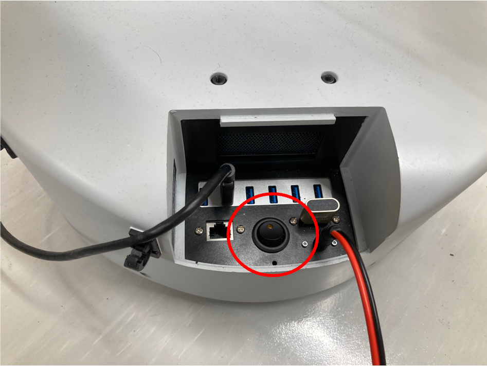
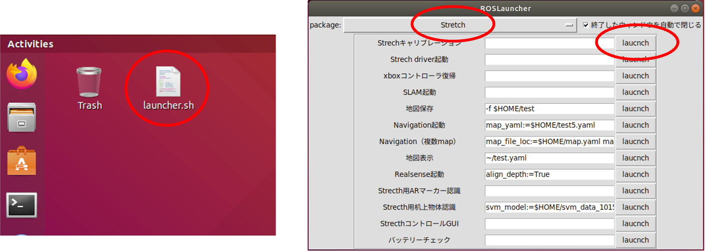
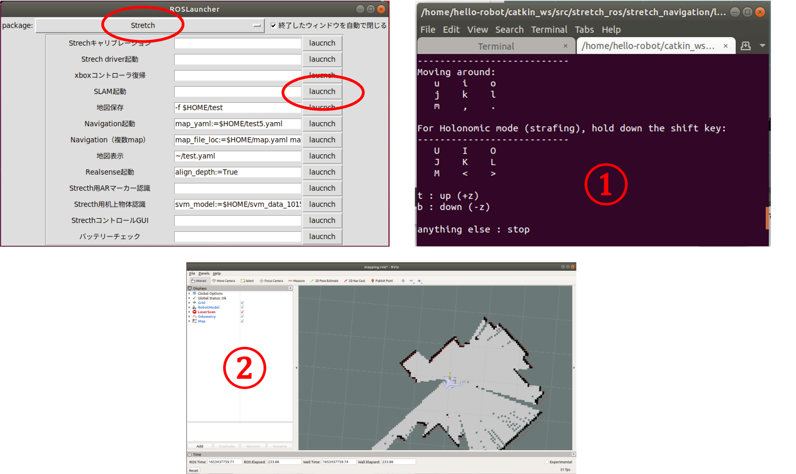
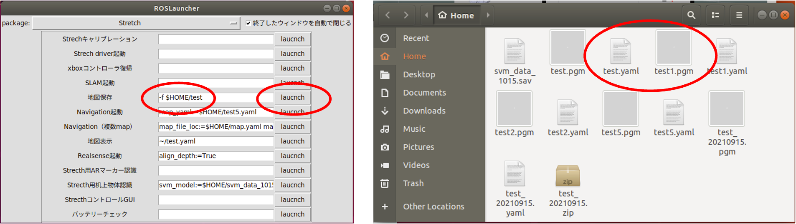
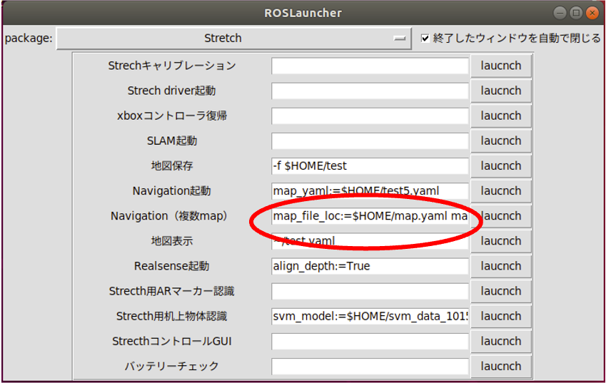

# Stretchの使い方（研究室用）

## 起動方法

- 後ろにあるスイッチをONにする  
  
- Ubuntuの起動音の後に「IP ○○ です」と発話する．このときの○○がStretchに割り当てたIPアドレスの末尾（192.168.1.○○）なので，IPアドレスが分からない場合は聞き逃さないこと．
- VNCで192.168.1.○○へアクセスする
- デスクトップにある`launcher.sh`を起動して，`Stretch`パッケージの`Stretchキャリブレーション`を実行
  
- Stretchのアームの昇降・伸縮，グリッパーの回転・開閉が行われる．動かない箇所がある場合には，再起動して，もう一度最初から実行する

## 終了方法

- Ubuntuをシャットダウンする
- (**この操作をするとアームが脱力して落下してくるので注意！**)背面のスイッチをOFFにする
  

## MAPの作成

- StretchへVNCでアクセスする
- lancherで`Stretch`の`SLAM軌道`を実行
- 起動したターミナル（図中①）上で，キーボード入力（ijkl,）でStretchを動かし，rviz（図中②）を見ながらMAPを作成
  
- lancherの`地図保存`横のテキストボックスに地図のファイル名（図の例では`test`）を入力して実行すると，HOMEディレクトリに保存される（図の例では`test.yaml`と`test.pgm`）
  

## 地図の編集

移動するためには自己位置推定用の地図と，パスプランニング用の2つの地図が必要となる．自己位置推定用の地図は前述の方法で作成したものをそのまま利用する．パスプランニング用の地図は編集して，移動してほしくない場所を黒く塗りつぶす必要がある．

- （準備中）

## ナビゲーションの実行

- lancherで`Stretch`の`Navigation（複数map）`横のテキストボックスに自己位置推定用の地図と，パスプランニング用の地図を指定し実行（デフォルトでは`map_file_loc:=$HOME/map.yaml map_file_pp:=$HOME/map_pp.yaml`となっており，`map.yaml`が自己位置推定用の地図，`map_pp.yaml`がパスプランニング用の地図）  
  
- rvizが立ち上げるので`2D Pose Estimate`で現在位置を指定  
  
- この状態で，プログラムから移動やアームの制御ができる
