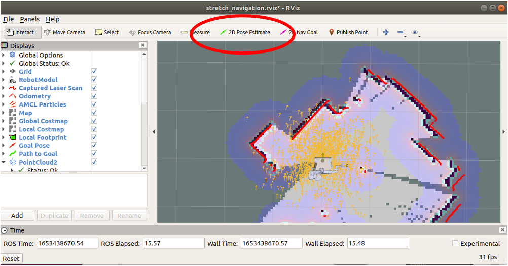
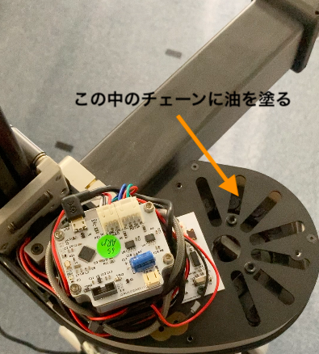

# Stretchの使い方（研究室用）

## 起動方法

- 後ろにあるスイッチをONにする  
  
- Ubuntuの起動音の後に「IP ○○ です」と発話する．このときの○○がStretchに割り当てたIPアドレスの末尾（192.168.1.○○）なので，IPアドレスが分からない場合は聞き逃さないこと．
- VNCで192.168.1.○○へアクセスする
- 接続できない場合はstretch内部PCのsettingsのsharingのScreen Sharingを左クリックして左上のボタンをONにする
- デスクトップにある`launcher.sh`を起動して，`Stretch`パッケージの`Stretchキャリブレーション`を実行
  
- Stretchのアームの昇降・伸縮，グリッパーの回転・開閉が行われる．動かない箇所がある場合には，再起動して，もう一度最初から実行する


## 終了方法

- Ubuntuをシャットダウンする
- (**この操作をするとアームが脱力して落下してくるので注意！**)背面のスイッチをOFFにする
  


## MAPの作成

- StretchへVNCでアクセスする
- lancherで`Stretch`の`SLAM軌道`を実行
- 起動したターミナル（図中①）上で，キーボード入力（ijkl,）でStretchを動かし，rviz（図中②）を見ながらMAPを作成
  
- lancherの`地図保存`横のテキストボックスに地図のファイル名（図の例では`test`）を入力して実行すると，HOMEディレクトリに保存される（図の例では`test.yaml`と`test.pgm`）
  


## 地図の編集

移動するためには自己位置推定用の地図と，パスプランニング用の2つの地図が必要となる．自己位置推定用の地図は前述の方法で作成したものをそのまま利用する．パスプランニング用の地図は編集して，移動してほしくない場所を黒く塗りつぶす必要がある．

- launcherで`Map`の`地図編集`の右側のテキストボックスに編集したい地図のファイル名を入力して起動  
  
- 画像上をドラッグすると線が書けるので侵入してほしくない場所を黒く，移動可能な場所を白くする（以下の例ではテーブルの領域を移動禁止領域として指定）  
  
  - 下側のスクロールバー：線の色（Color）と太さ（Size）の変更
  - `i`, ` j`, `k`, `m`キー：地図のスクロール
  - `z`キー：元に戻す
  - `s`キー：保存
  - `q`キー：終了
- 編集が完了したら`s`キーを押すとファイル保存ダイアログが起動するのでファイル名を入力し保存．このとき自己位置推定用の地図との対応が分かりやすいようにファイル名の末尾に`pp`をつける（`pp`は**P**ath **P**lanningの頭文字）
  - 例：自己位置推定用→`map516.yaml`，パスプランニング用→`map516pp.yaml`
  - 保存するとpgmファイルと，yamlファイルの2つが作られる  


## ナビゲーションの実行

- lancherで`Stretch`の`Navigation（複数map）`横のテキストボックスに自己位置推定用の地図と，パスプランニング用の地図を指定し実行（デフォルトでは`map_file_loc:=$HOME/map.yaml map_file_pp:=$HOME/map_pp.yaml`となっており，`map.yaml`が自己位置推定用の地図，`map_pp.yaml`がパスプランニング用の地図）  
  
- rvizが立ち上げるので`2D Pose Estimate`で現在位置を指定  
  
- この状態で，プログラムから移動やアームの制御ができる


## その他注意事項
- 緊急停止ボタン
  - stretch上部に緊急停止ボタンがあるので危険な行動をした際には即座に押せるように心がける
  - stretchが動かない場合は押されていないか確認する
  - 短く押すと緊急停止，長く押すと解除
  

- 充電
  - 使用後は必ず充電をすること，12V AGM
  - 使用中に充電する場合は，12V supply
  
  
- アームが動作中に止まってしまう場合  
  トルクがしきい値を超えて，接触と誤判定しているのが原因．止まってしまう場合には，以下のyamlファイルに書かれている，このしきい値を書き換える．  
  ~/stretch_user/stretch-re1-****/stretch_re1_factory_params.yaml

  アームの伸縮に関しては，ファイル内のarmの項目の
  ```
  contact_thresh_N:
  - -46.63833379211425
  - 58.98148471069336
  ```
  の部分の値を大きくする．
  昇降に関しても同様に，liftの項目の
  
  ```
  contact_thresh_N:
  - -69.52946977615358
  - 62.4825942993164
  ```
  の部分の値を大きくする．
  
- アームの伸縮が止まってしまう場合  
  アーム伸縮の油が切れているのが原因の可能性がある．アームの根本（肩の部分）のカバーを開けて，チェーン部分にシリコンスプレーを塗布する．  
  
