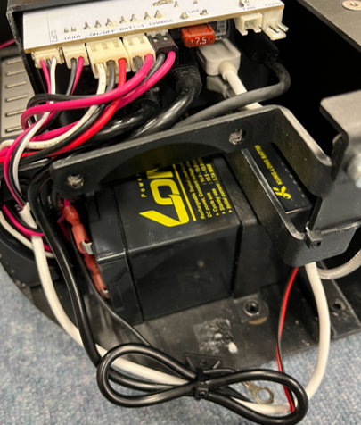

# Stretchのバッテリー交換手順
1. リフトを上げて固定
1. カバー外す，上方に固定
1. 横に倒して底面のネジ外す
   - 
   - クッションなどでヘッドの方を支えながら作業する
   - 画像内の赤丸で囲んだ，支柱の4+2本，後輪周囲の4本，前の端2本は外さない
   - 緑の三角で示しているのは長いネジの場所
   - 外すのは合計で**18本**(うち長ネジ2本)
1. 後方のバッテリーから交換していく
   1. Stretchを起こす
   1. 配線の邪魔な部分を抜いていく
       - 
       - 左図青丸で囲んだ配線とファンの固定を外す
       - 右図は外した後の様子
   1. バッテリーを取り出す
       - バッテリーの配線は先に抜く
       - 
   1. 新しいバッテリーをフレームと一緒に挿入
       - 
1. 前のバッテリーを交換する
   1. 配線を外す
      -  図中青丸の配線
      -  
   1. 支柱とベースを固定している部分のネジを緩める，外す       
      -  図中赤丸のネジ
      -  
   1. 横に倒して底面をフレームから離し，隙間を作ってバッテリーを取り外す
      - バッテリーを固定していたフレームを先に外す
      - 
   1. 新しいバッテリーを搭載，配線
      - 
1. ネジ，配線を元通りに戻す
   1. 底面とフレームの隙間戻し支柱横のネジを固定
   1. 横に倒しながらバッテリーを固定するフレームをネジ止めしバッテリーが動かないように
   1. 外していた配線，ファンなどをもとに戻す
   1. 横に倒して底面のネジ締め
   1. カバー戻して完了
