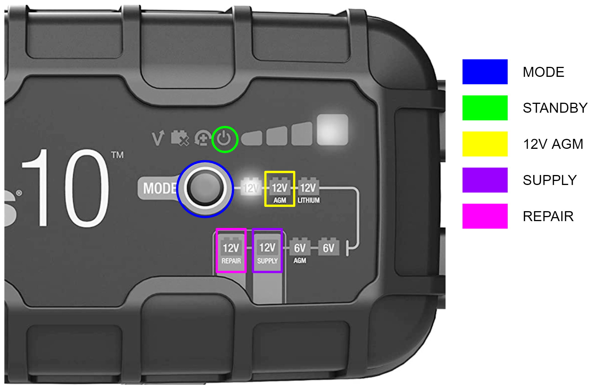

# バッテリーのリカバリーに関するメモ

参考サイト：https://docs.hello-robot.com/0.1/battery_maintenance_guide/#repairing-damaged-batteries

## リカバリーについて
- Stretchのバッテリーが損傷し，ロボットの充電を維持するのが難しい場合に行う

## 充電器のインターフェース  
  

## 手順
1. Stretchの電源スイッチを切り，充電器をロボットから取り外す
1. 充電器を12V SUPPLYモードにする  
  
1. 充電器を取り付け，Stretchを4-8時間充電する  

1. 充電器を12V REPAIRモードにする  
  
1. 充電がスタンバイに戻るまで充電する  
    
  ※公式サイトには最大4時間とあるが，4時間を超える場合もある
1. 充電器を12V AGMモードに変更して終了  
  